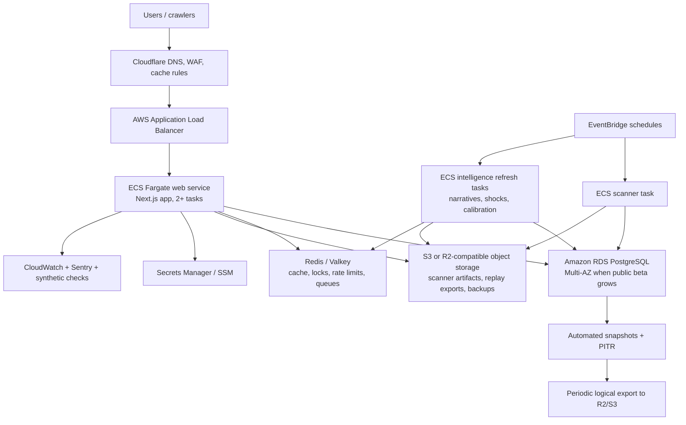

# Phase 11.9 Cloud Migration Readiness Plan

This document is a readiness plan only. No production migration was performed.

## Current Infrastructure Audit

TradeVeto currently runs as a controlled-beta Linux Docker deployment.

| Area | Current state | Cloud-readiness implication |
| --- | --- | --- |
| Web app | `market-alpha-frontend` Next.js container built from `frontend/Dockerfile`, exposed on port `3001` through the external `public-edge` Docker network. | Mostly container-ready, but the app still depends on mounted local artifacts and a single local DB endpoint. |
| Database | `market-alpha-postgres` Postgres 16 container with host-mounted volume under `/opt/apps/market-alpha-scanner/runtime/postgres`. | Good for controlled beta, not HA. Cloud migration should move to managed Postgres with automated backups and PITR. |
| Scanner jobs | `market-alpha-scanner-job` Docker Compose profile runs `investment_scanner_mvp.py --fast --timing --outdir /app/scanner_output`. | Scanner is separable, but it writes local files and should become an ECS scheduled task or worker writing to object storage/database. |
| Derived intelligence refresh | Ops scripts run Node jobs in disposable Docker containers for narratives and shock patterns. | This maps well to scheduled ECS tasks/EventBridge jobs, but should not remain host-cron coupled. |
| Artifacts | `scanner_output` is host-mounted into the web container read-only. | This is the biggest stateless-app blocker. Move durable scanner/replay artifacts to S3 or R2-compatible object storage. |
| Backups | Host scripts wrap `/opt/ops/market-alpha-backup.sh`, with R2/offsite backup conventions documented in ops docs. | Good beta posture. Cloud should add managed DB snapshots/PITR plus periodic logical exports to R2/S3. |
| Monitoring | App health endpoints, synthetic checks, system checks, route budget script, Sentry env support, and operational docs. | Strong baseline, but cloud needs independent CloudWatch/ALB/RDS metrics and alert routing outside the app DB. |
| Edge | Cloudflare plus Caddy/reverse proxy outside this compose file, connected through `public-edge`. | Cloud target should keep Cloudflare and replace Caddy with ALB unless there is a strong reason to keep Caddy on EC2. |
| Secrets | Compose reads many secrets from env and expands them into `docker compose config` output unless redacted. | Cloud should use Secrets Manager or SSM Parameter Store. Operator commands must use redacted config helpers only. |

## Current Bottlenecks

1. Single-host Postgres is the first hard scaling and availability limit.
2. Local `scanner_output` mounts prevent safe horizontal scaling of the web container.
3. Host cron and ad-hoc Docker jobs are operationally workable, but not cloud-native or easily observable.
4. Terminal/dashboard/replay/heatmap routes are improved, but still depend on heavy derived-intelligence reads that should be cached/precomputed before broad growth.
5. LLM cost and timeout controls exist, but multi-instance enforcement depends on DB-backed accounting and cache behavior.
6. A raw `docker compose config` can expose secrets if operators do not use redacted scripts.
7. Monitoring is strong for one host, but not yet a full cloud observability stack.

## Target Architecture

## ECS/Fargate vs EKS

Recommended first cloud target: ECS on Fargate.

Why:

- TradeVeto already has clean container boundaries: web, scanner job, refresh jobs.
- Current service count is small enough that Kubernetes would add operational surface without enough payoff.
- ECS scheduled tasks map directly to scanner and intelligence refresh jobs.
- Fargate removes node patching and right-sizing work during controlled public beta.
- EKS adds a cluster management tax and operational complexity before TradeVeto has enough services to justify it.

EKS becomes reasonable when TradeVeto has many independently deployed services, needs Kubernetes-native controllers/operators, service mesh patterns, complex multi-tenant workloads, or a dedicated platform team. EKS also carries a cluster support charge in addition to worker compute.

## Redis / Queue Timing

Redis or Valkey is not mandatory for the first cloud cutover if traffic is still controlled and DB-backed rate limits/cache remain healthy.

Add Redis when any of these become true:

- More than one web replica needs shared hot cache, distributed locks, or shared rate-limit counters.
- Research Copilot, dashboards, and opportunity pages start repeating expensive synthesis under load.
- Scanner/intelligence jobs need queueing, retry coordination, or mutual-exclusion locks.
- Live/intraday features need pub-sub or fast ephemeral state.
- p95 dynamic route latency exceeds budget even after DB/query tuning.
- API/webhook public usage requires higher-throughput quota enforcement.

For AWS, ElastiCache for Valkey is preferred over Redis OSS for new deployments unless compatibility requires Redis OSS.

## Cloud Migration Triggers

Stay on the current Linux Docker deployment until at least one trigger is consistently visible:

- More than 100-250 daily active users or more than 20-50 concurrent active users.
- Need for more than one web replica for availability or traffic.
- Postgres CPU, memory, or disk pressure regularly exceeds 70%.
- Route budgets degrade: terminal/dashboard/opportunities p95 above 3 seconds under real traffic.
- Scanner/refresh jobs interfere with web responsiveness.
- RTO/RPO expectations become stricter than a single-host restore can support.
- Public API/webhooks create bursty external traffic.

Estimated capacity, assuming current route optimizations remain valid:

| Stage | Practical range | Notes |
| --- | --- | --- |
| Current Linux Docker | 50-150 beta users, 5-20 concurrent active users | Depends heavily on dashboard/replay use and scanner job timing. |
| ECS + RDS, no Redis | 500-2,000 beta users, 50-150 concurrent users | Requires artifact externalization and precomputed dashboard summaries. |
| ECS + RDS + Redis/workers | 2,000-10,000 users, 150-500 concurrent users | Requires queueing, cache hit-rate tracking, route-level autoscaling. |
| Advanced scale | 10,000+ users, 500+ concurrent users | Consider read replicas, API tier separation, stronger streaming architecture, possibly EKS only if service count justifies it. |

These are planning estimates, not load-test results.

## Monthly Cost Ranges

Approximate AWS us-east-1 planning ranges, excluding OpenAI, paid market data, Stripe fees, Sentry paid plans, email provider costs, and support plans.

| Architecture | Estimated monthly cost | Assumptions |
| --- | ---: | --- |
| Phase 1 controlled cloud | $180-$450 | ECS Fargate web service, small RDS Postgres Single-AZ, ALB, CloudWatch, object storage, one NAT or public egress design. |
| Phase 2 public beta HA | $500-$1,200 | 2+ Fargate tasks, RDS Multi-AZ, scheduled ECS jobs, Redis/Valkey small, stronger monitoring and backups. |
| Phase 3 larger beta | $1,200-$3,500+ | More workers, Redis HA, larger RDS, possible read replica, higher logs/metrics, API/webhook traffic. |
| Advanced scale | $3,500+/month | Real-time/intensive workloads, read replicas, higher concurrency, dedicated observability, larger caches/workers. |

Cost notes:

- Fargate charges by requested vCPU, memory, OS/architecture, and storage from image pull through task termination.
- ALB has both an hourly charge and LCU usage charges.
- RDS `db.t4g.medium` PostgreSQL Single-AZ us-east-1 pricing currently resolves around `$0.065/hour` via the AWS public pricing API, before storage/backups.
- ElastiCache/Valkey `cache.t4g.small` us-east-1 pricing currently resolves around `$0.0256/hour` via the AWS public pricing API.
- EKS has a separate per-cluster support fee, so it is not the cheapest first migration target.
- NAT Gateway, public IPv4, logs, cross-AZ traffic, and data transfer can become surprising line items.

Official pricing references:

- AWS Fargate pricing: https://aws.amazon.com/fargate/pricing/
- Amazon EKS pricing: https://aws.amazon.com/eks/pricing/
- Amazon RDS for PostgreSQL pricing: https://aws.amazon.com/rds/postgresql/pricing/
- Amazon ElastiCache pricing: https://aws.amazon.com/elasticache/pricing/
- Elastic Load Balancing pricing: https://aws.amazon.com/elasticloadbalancing/pricing/

## Phased Migration Plan

### Phase 0: Readiness Before Cloud

- Keep current Linux deployment as production.
- Remove local artifact assumptions from web runtime.
- Move scanner/replay artifacts to object storage or add a compatibility layer that can read from both local path and object storage.
- Add a migration runner pattern for DB schema changes.
- Document required environment variables and secrets with redacted validation.
- Confirm every production ops script has a cloud equivalent or a retirement path.
- Add authenticated performance checks for premium pages.
- Add a staging environment that can run against a restored DB snapshot.

Exit criteria:

- Web container can run without host-mounted `scanner_output`.
- Scanner job can write to object storage and DB idempotently.
- Restore drill can populate staging from backup.
- Redacted config workflow is the only documented compose/config inspection path.

### Phase 1: Managed Data Plane

- Provision RDS Postgres in the same region as planned ECS.
- Restore latest backup into RDS staging.
- Validate table counts, scanner snapshots, replay data, billing/account data, and intelligence tables.
- Configure automated backups, PITR, encryption, and deletion protection.
- Keep Linux web app primary while testing RDS-backed staging.
- Decide whether object storage is AWS S3, Cloudflare R2, or dual-write during transition.

Exit criteria:

- Staging app passes health/deep health against RDS.
- Scanner and refresh jobs pass against RDS staging.
- Backup and restore runbook covers both managed snapshots and logical exports.

### Phase 2: ECS/Fargate Web Cutover

- Push web/scanner images to ECR.
- Create ECS cluster, Fargate task definitions, ALB, target groups, and CloudWatch logs.
- Store secrets in Secrets Manager or SSM Parameter Store.
- Run web service with at least two tasks for public beta.
- Move scheduled scanner/intelligence jobs to EventBridge-triggered ECS tasks.
- Keep Cloudflare in front of ALB.
- Perform canary DNS cutover through Cloudflare.

Exit criteria:

- `/api/health` and `/api/health/deep` pass on cloud.
- Social crawler routes work behind Cloudflare/ALB.
- Stripe webhooks validate in cloud.
- OpenAI fallback behavior works under timeout.
- Rollback to Linux is documented and tested with DNS TTL low.

### Phase 3: Worker, Queue, and Cache Separation

- Add Redis/Valkey or SQS depending on workload shape.
- Move expensive intelligence synthesis into scheduled/background jobs.
- Add distributed locks for scanner and refresh jobs.
- Add API/webhook quota counters to Redis or a purpose-built quota store.
- Add cache hit-rate and queue-depth monitoring.
- Consider RDS read replica if read pressure grows.

Exit criteria:

- Web tasks are mostly stateless.
- Heavy intelligence work is no longer executed on page render.
- Job retries and failures are visible.
- Dashboard/replay p95 stays within route budget under beta load.

### Phase 4: Advanced Scale

- Split API/webhook tier from web UI if external usage grows.
- Add read replicas or materialized summary stores.
- Add stronger streaming/event infrastructure for real-time regime drift.
- Consider EKS only if service count, platform needs, or team structure justify Kubernetes.
- Add multi-region disaster recovery only after single-region operations are boring.

## Rollback Strategy

- Keep the current Linux host as the production fallback during the first cloud cutover.
- Use short Cloudflare TTLs and canary traffic before full switch.
- Freeze writes briefly for the final DB cutover if bidirectional sync is not implemented.
- Preserve a fresh logical dump and RDS snapshot before cutover.
- Maintain artifact sync between current storage and cloud object storage until rollback window closes.
- If cloud health/deep health fails or billing/auth/webhook checks fail, route traffic back to Linux and investigate off-path.

## Operational Risks

| Risk | Mitigation |
| --- | --- |
| Secret exposure through config commands | Use only redacted config scripts; never persist raw `docker compose config` output. |
| Local artifact dependency | Externalize `scanner_output`, replay artifacts, and backups before horizontal scaling. |
| DB migration drift | Use staging restore, table-count validation, and final write freeze during cutover. |
| Cloudflare/ALB header mismatch | Validate canonical host, HTTPS redirects, crawler user agents, and Stripe webhook URLs. |
| NAT/egress cost surprise | Model OpenAI/market-data egress path explicitly; prefer VPC endpoints where useful. |
| LLM cost spike | Keep Phase 11.8 budgets, cache, fallback, and spend alerts enabled before public traffic. |
| Scanner duplicate runs | Use DB locks/job leases before multiple workers exist. |
| Monitoring blind spots | Add CloudWatch alarms independent of app-side monitoring tables. |

## Sanity Review Results

- Docker Compose config parses with placeholder DB password.
- Current compose structure cleanly separates web, Postgres, scanner job, and legacy optional services.
- A raw compose config command expanded local secrets during audit; the temporary output was deleted immediately. This confirms redacted config inspection is a required operating rule before broader team access.
- Existing route-budget and ops-green scripts provide a usable baseline for cloud acceptance checks.
- `/opt/ops/market-alpha-compose-config-redacted.sh` was not present in the local dev environment, so redacted compose inspection is documented but not locally runnable here.

## Migration Readiness Verdict

Current readiness: controlled-beta cloud planning is clear, but immediate migration is not recommended until local artifact dependencies and staging restore validation are complete.

Recommended next action:

1. Make scanner/replay artifacts object-storage ready.
2. Create RDS staging restore and validate the app against it.
3. Add cloud-equivalent scheduled job definitions.
4. Run authenticated route-performance checks on staging.
5. Only then start ECS/Fargate cutover planning.

Final status: CLOUD MIGRATION PLAN READY
