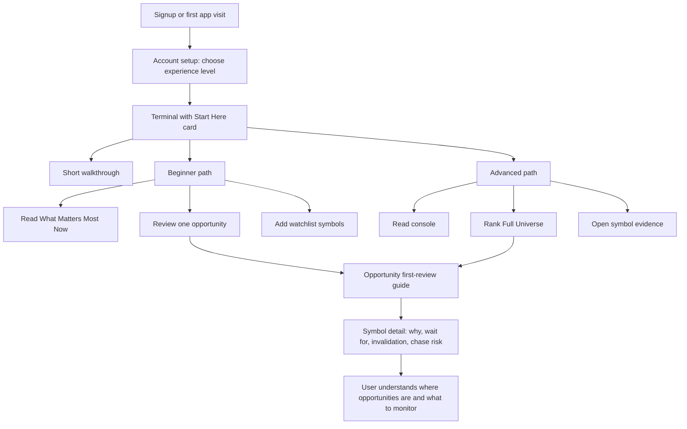

# Phase 12.3 Start Here Experience

Date: 2026-05-10

Final status: START HERE EXPERIENCE READY

## Objective

Make first-time users understand TradeVeto within minutes by giving them one clear starting path:

1. Read the market state.
2. Review one opportunity.
3. Save a small watchlist.

This pass strengthens the existing first-run onboarding instead of adding another large product surface.

## What Changed

### Start Here Card

The first-run card now frames TradeVeto as a simple three-minute workflow:

- Understand the market state.
- Review one opportunity.
- Save symbols to revisit.

It includes beginner and advanced paths, but both paths keep users inside the core workflow instead of sending them into dense proof/lab surfaces too early.

Beginner path:

- Read the market read.
- Review one idea.
- Build your watchlist.

Advanced path:

- Read the console.
- Rank the universe.
- Open evidence on a representative symbol.

### Plain-English Concept Guide

The Start Here card now includes a collapsible guide that explains:

- WAIT-first
- Fragility
- Asymmetry
- Shock opportunity
- Risk/reward controls
- What Matters Most

The copy avoids internal scoring language and explains what the user should do with each concept.

### Walkthrough Copy

The guided walkthrough now uses simpler language:

- WAIT is explained as an active decision.
- Risk/reward controls are explained as a way to change research lists without weakening the core warning.
- Symbol detail is framed around four questions: why it matters, what to wait for, what invalidates it, and whether chasing is risky.
- Watchlists are framed as the way TradeVeto shows what changed later.

### First Opportunity Review

The Opportunities page now shows a guided first opportunity review prompt for first-run users. It tells users not to scan every card first and instead review one candidate through three checks:

- Why it appears.
- What to wait for.
- What can break it.

The `tab=full` onboarding link is now honored, so advanced users who choose "Rank the universe" land in the intended Full Universe view.

### Account Setup

The account onboarding gate now tells users that the first session focuses on one market read, one opportunity, and one watchlist. It also explains that they do not need to understand every score on day one.

### Help Button

The header `?` button is now labeled as the Start Here guide instead of just "Replay onboarding."

## Onboarding Flow Map

## Confusion Points Fixed

| Confusion point | Fix |
| --- | --- |
| New users may not know where to start | Start Here card now gives a three-step workflow |
| Advanced users were sent to Strategy Labs too early | Advanced path now stays in Terminal, Opportunities, and Symbol Evidence |
| Terms like fragility/asymmetry/shock can feel abstract | Added collapsible plain-English guide |
| Opportunities could feel like too many cards at once | Added first opportunity review prompt |
| `tab=full` onboarding link did not set the Full Universe tab | Opportunities now reads the tab query parameter |
| Header help button sounded like a replay tool only | Renamed to Start Here guide |
| Account setup sounded like profile configuration, not product orientation | Copy now explains the first useful session |

## First Useful Action

The target first useful action is:

> Open one opportunity and understand why it appears, what to wait for, and what could break it.

This is more useful than asking a new user to explore every dashboard, proof panel, or advanced intelligence layer.

## Beginner Explanation Standards

New-user copy should follow these rules:

- Explain what a concept means for the user's next action.
- Avoid score-only language.
- Do not introduce advanced systems before the first useful action.
- Keep risk language calm and non-punitive.
- Use "research" and "watch" language, not direct trading instructions.

## Screenshots

Captured screenshots are stored in:

`artifacts/phase-12-3-start-here/screenshots`

Captured screenshot set:

- `terminal-start-here-desktop.png`
- `terminal-start-here-mobile.png`
- `opportunities-first-review-desktop.png`
- `opportunities-first-review-mobile.png`
- `account-onboarding-desktop.png`

Notes:

- Terminal screenshots show the Start Here card after the risk acknowledgement state is cleared.
- Opportunities screenshots show the free/public first-run path because the local dev-login endpoint was rate-limited during capture. The premium first-opportunity guide is covered by the compiled client code and TypeScript/build validation.
- Account screenshot shows the reachable local account entry state in the same public/free capture context.

## Remaining Onboarding Risks

- The risk acknowledgement modal can still appear before the user has fully understood the value proposition.
- Premium/free states need continued QA so locked views explain what to do next instead of feeling like dead ends.
- Symbol detail remains deep; the next simplification pass should tab it into Overview, Timing, Evidence, and Journal.
- If local storage marks onboarding complete, users may not see the Start Here card unless they click the header help button.
- First-run screenshots in local unauthenticated mode may not show the full premium workflow.

## Validation Notes

- This pass touched onboarding UI and the Opportunities client workflow.
- `npm run lint` passed.
- `npm run build` passed.
- No scanner jobs were run.
- The local preview server was used only for route rendering and screenshots.
